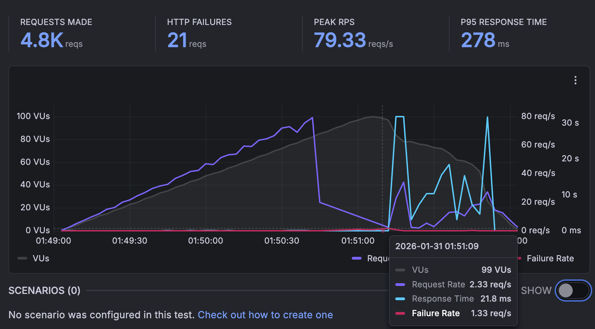
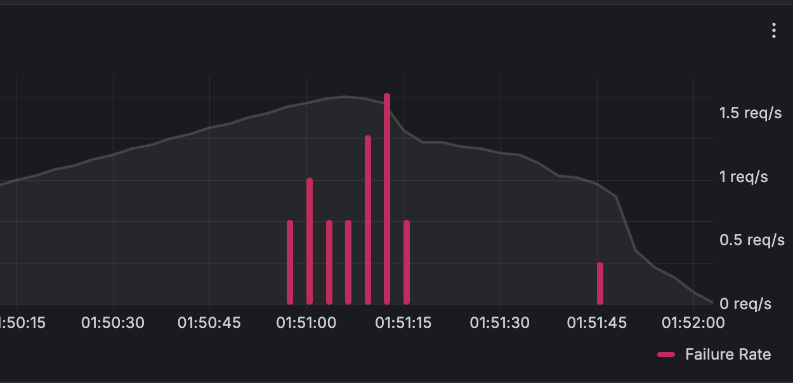
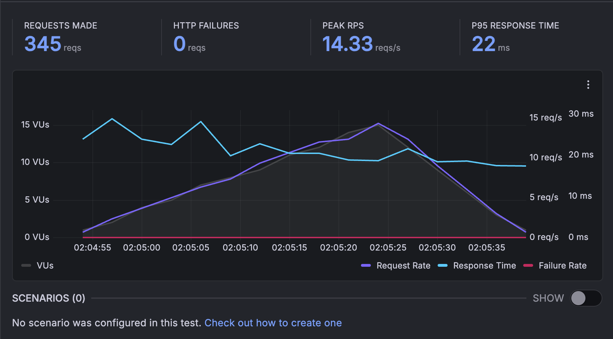

# 대량 동시 요청 설계 

## 단일 서버 기준 (ver.1) vs redis streams 적용 기준(ver.2)

1. 단일 서버 기준으로 수용 가능한 최대 유저수를 파악하기 (ver.1)
2. redis streams 적용해서 변화된 부분 파악하기 (ver.2)

---
## ver.1 : 단일 서버 기준으로 수용 가능한 최대 유저수를 파악하기

서비스의 특성상 **식사 시간대**에 사용자 요청이 폭발적으로 증가할 것으로 예상됩니다.

- 점심: 12:00 ~ 14:00
- 저녁: 16:00 ~ 19:00

이에 따라 병목이 생기지 않고 안정적으로 처리 가능한 **최대 유저 수**를 고려한 설계가 필요합니다.  
(현재는 **scale up/out 없이 단일 서버 기준**으로 분석합니다.)

---

## 단일 서버 환경

| 항목                    | 값                     |
|-----------------------|----------------------|
| CPU                   | 1 vCore               |
| 메모리                   | 1 GB                  |
| 디스크                   | 50 GB                 |
| Tomcat Threads        | 100                   |
| DB Connection Pool    | 50                    |
| Redis Connection Pool | 14                    |


## 지연 가능성이 있는 로직

기능 : 자연어 기반 추천 

- 유저 1명이 LLM 추천 호출 1건당 발생시키는 DB 쿼리 수: **1개**
- LLM 호출 시 고려 사항:
  - 현재 위치(경도, 위도)
  - 최대 거리
  - 자유 텍스트 선호도

처리 로직 순서:

1. 사용자 요청 → Gemini API 호출하기
  - 사용자 선호도를 LLM으로 파싱해서 얻은 응답은 장소타입에 대한 정보
2. Redis에서 저장된 장소타입에 해당되는 장소id 리스트 형태로 얻어내기
3. 장소id와 특정 거리 내 조건 적용해서 DB에서 조회

```sql
SELECT *
FROM stores
WHERE place_id IN :placeIds
  AND (
        6371 * acos(
            cos(radians(:latitude)) * cos(radians(latitude)) * 
            cos(radians(longitude) - radians(:longitude)) +
            sin(radians(:latitude)) * sin(radians(latitude))
        )
      ) <= :radiusKm
ORDER BY (
        6371 * acos(
            cos(radians(:latitude)) * cos(radians(latitude)) * 
            cos(radians(longitude) - radians(:longitude)) +
            sin(radians(:latitude)) * sin(radians(latitude))
        )
      ) ASC;
```
## 부하 테스트 툴 

k6 택

이유: 분산 부하 테스트 지원. [grafana 와 cli로 연결된 k6](https://grafana.com/docs/k6/latest/results-output/real-time/cloud/), go 루틴 (스레드보다 더 vu 빨리 만듬)

- 결과
[시나리오1]
  - 총 iterations: 4774번
  - 실행 시간: 3분 (2분 ramp-up + 1분 ramp-down)
  - 최대 VU: 100명
  - p(90)=58.86ms
  - 요청 실패율 :  0.43%  21 out of 4774





- 결과
  [시나리오2]
  - 총 iterations: 345번
  - 실행 시간: 35.9초 (30초 유지 + 5초 ramp-down)
  - 최대 VU: 15명
  - p(90)=19.75ms
  - 요청 실패율: 0.00% (0 out of 345)



---
==> 100vu, 1초마다 요청, 3분 동안 총 4000개의 요청시, timeout 30개 예상 원인

커넥션 풀,서버 스레드가 이미 다른 요청들에 의해 점유되어 지연시간이 길어져 timeout이 났다고 생각합니다.


## ver.2 : redis streams 적용해서 변화된 부분 파악하기

1. redis streams 이용해서 client 요청 저장 <- LLM consumer group에서 worker가 처리


    * client는 PROCESSING (처리중), requestid (요청id) 으로 응답 받음
    * polling 반복적으로 요청하기 (클라이언트에서 polling 하는 주기는 = 800ms로 고정)


2. LLM 호출후 redis에서 장소id 조회 <- 1번 처리하던 worker가 그대로 처리

3. redis streams 이용해서 DB요청 저장 <- DB consumer group에서 worker가 처리

4. postgresql 조회 <- 3번 처리하던 worker가 그대로 처리

5. worker 처리 완료후 redis에 결과 저장 (TTL설정)

- 단일 요청

설정 : llm consumer 2개, db consumer 1개

| 단계 | 소요 시간 (ms) |
| --- | --- |
| LLM 호출 + 처리 | 2993~2998 |
| Redis Lookup (LLM stage) | 1 |
| DB 직렬화 + Stream XADD | 1 |
| DB 조회 + 처리 | 28 |
| Redis Stream ack (LLM) | 0 |
| Redis Stream ack (DB) | 0 |
| **총합** | 약 3026 ms |

- 결과[시나리오1]
  - 
## redis가 꺼진다면?

## kubernetes 적용 


